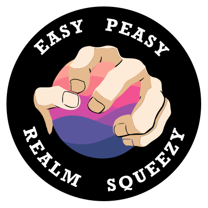

<h3 align="center">
    
</h3>
<h1 align="center">
  EasyRealm
</h1>


[](http://cocoapods.org/pods/EasyRealm)
[](https://github.com/Carthage/Carthage)
[](http://cocoapods.org/pods/EasyRealm)
[](https://travis-ci.org/PoissonBallon/EasyRealm)
[](https://developer.apple.com/swift/)
[](https://codecov.io/gh/PoissonBallon/EasyRealm)
[](http://cocoapods.org/pods/EasyRealm)

EasyRealm is a micro-framework (less than 200 LOC) that helps you use Realm.

## Versions guides

| Swift     | Realm     | EasyRealm |
|-----------|-----------|-----------|
| 3.0       | >= 2.4    | 2.0.1     |
| 3.2 / 4.0 | >= 3.1.0  | >= 3.0.0  |
| 4.2       | >= 3.10   | >= 3.4.0  |

## Keys Features

EasyRealm import many features as :

* Deep cascade deleting
* Deep unmanaged object
* Get managed object from unmanaged object.
* Multithread Action (save / edit / delete / query)

## Promise

EasyRealm make 4 promises :

* EasyRealm never transform secretly an unmanaged Object to a managed Object and vice-versa.
* EasyRealm let you use managed and unmanaged objects identically.
* EasyRealm never manipulate thread behind your back, you keep full control of your process flow.
* EasyRealm never handle Error for you.

## Examples

### Using

* No inheritance.
* No protocol.
* Import Framework
* Enjoy

### Save

To save an object :

```swift
let pokemon = Pokemon()
try pokemon.er.save(update: true)
//OR
let managed = try pokemon.er.saved(update: true)
```

### Edit

To edit an object :

```swift
let pokemon = Pokemon()

try pokemon.er.edit {
  $0.level = 42
}
```


### Delete

To delete an object :

```swift
let pokemon = Pokemon(name: "Pikachu")

try pokemon.er.delete()
//or
try pokemon.er.delete(with: .simple)
//or
try pokemon.er.delete(with: .cascade)

```

To delete all objects :
```swift
try Pokemon.er.deleteAll()
```

### Queries

To query all objects of one type :
```swift
let pokemons = try Pokemon.er.all()
```

To query one object by its primaryKey :
```swift
let pokemon = Pokemon.er.fromRealm(with: "Pikachu")
```

### Helping Variables

* isManaged :
```swift
pokemon.er.isManaged // Return true if realm != nil and return false if realm == nil
```

* managed :
```swift
pokemon.er.managed // Return the managed version of the object if one exist in Realm Database
```

* unmanaged :
```swift
pokemon.er.unmanaged // Return an unmanaged version of the object
```


## Installation

EasyRealm is available through [CocoaPods](http://cocoapods.org). To install
it, simply add the following line to your Podfile:

#### CocoaPods
```ruby
use_frameworks!
pod "EasyRealm", '~> 3.2.0'
```

#### Carthage
```ruby
github 'PoissonBallon/EasyRealm'
```

## Author

* PoissonBallon [@poissonballon](https://twitter.com/poissonballon)

## License

EasyRealm is available under the MIT license. See the LICENSE file for more info.

## Other

* Thanks to [@error32](http://savinien.net/) for logo
* Thanks to [@trpl](https://github.com/trpl) for text review
